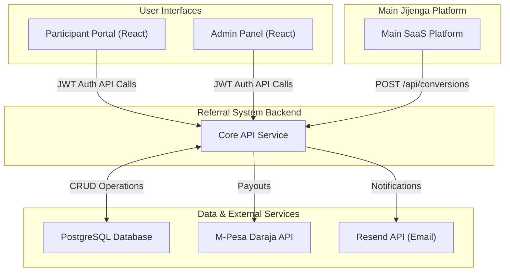

# Jijenga Referral System - Concept Design Document (CDD)

**Version:** 1.0

**Date:** June 5, 2025

**Framework Owner: Jijenga CTO - Yusuf**

**Document Status:** Draft for Review

---

## 1. Executive Summary

The Jijenga Referral System is a strategic internal tool designed to manage Jijenga launch referral program. The system will serve 50 Kenyan beta users who will earn 50 KSH per successful referral monthly for 6 months (dependant on churn). This self-contained platform provides automated tracking, transparent earnings visibility, and seamless M-Pesa payouts while requiring minimal integration with our main Jijenga platform through strategic API calls.

**Key Value:** Eliminate manual referral program management while providing transparency and automation for both internal team and referral participants.

**MVP Timeline:** September 2nd week 2025 (3-month development window)

---

## 2. Problem/Opportunity Statement

**Problem:** Jijenga lacks an efficient system to manage the entire referral program lifecycle - from participant onboarding through payment disbursement. Manual management would be error-prone, time-consuming, and not scalable for our launch strategy.

**Opportunity:** Create a competitive advantage through a well-managed referral program that incentivizes early adopters while providing transparent tracking and automated processes, supporting our strategic launch objectives.

**Impact:** Without this system, we risk:

- Manual tracking errors leading to incorrect payments
- Poor participant experience due to lack of transparency
- Significant time investment from leadership team
- Potential compliance issues with financial record-keeping

---

## 3. Target Audience & User Personas

### Primary Users (Internal Team)

- **CTO:** Program oversight, technical management, system configuration
- **CEO**: Strategic oversight, performance monitoring, ROI analysis
- **Finance Team**: Payment approvals, financial tracking, compliance

### Secondary Users (Referral Participants)

- **Profile**: 50 Kenyan beta users, tech-savvy early adopters
- **Demographics**: Kenyan professionals with M-Pesa accounts
- **Goals**: Generate supplementary income through referrals
- **Pain Points**: Need transparency in earnings and reliable payment processing
- **Technical Context**: Primarily smartphone users, expect mobile-friendly interfaces

---

## 4. Goals & Success Metrics

### User Goals (Referral Participants)

- Easily generate and share referral links
- Track referral performance in real-time
- Understand earning potential and payment schedules
- Receive timely and accurate M-Pesa payments

### Business Goals

- Successfully onboard and manage 50 beta referral partners
- Achieve target conversion rates from referral traffic
- Automate 80%+ of referral program operations
- Maintain accurate financial tracking and compliance
- Support Jijenga platform launch strategy

### Success Metrics (80/20 Critical KPIs)

- **Conversion Rate**: Referral clicks → Paid subscriptions
- **Active Participants**: Users generating referrals vs. dormant accounts
- **Revenue Attribution**: Total revenue generated through referrals
- **Payment Efficiency**: Processing time and success rates
- **Top Performers**: Identify most effective referrers

---

## 5. Proposed Concept & Value Proposition

**For Kenyan beta users and startup teams who need efficient referral program management, the Jijenga Referral System is a self-contained management platform that provides automated tracking, transparent earnings visibility, and seamless M-Pesa payouts, eliminating manual processes and ensuring accurate commission distribution.**

---

## 6. User Journeys & Key Scenarios

### Journey A: Referral Participant (Beta User)

### Happy Path Flow:

1. **Invitation & Onboarding**
    - Receives email invitation from admin
    - Creates account with separate credentials
    - Completes profile setup (M-Pesa number verification)
2. **Link Generation & Sharing**
    - Logs into participant dashboard
    - Generates personalized referral link
    - Copies/shares link via preferred channels
3. **Performance Monitoring**
    - Monitors dashboard for clicks and conversions
    - Views real-time earnings calculations
    - Tracks 6-month earning cycle per referral
4. **Payment Processing**
    - Receives monthly M-Pesa payments automatically
    - Views payment history and upcoming payments
    - Manages M-Pesa account details

### Alternative Scenarios:

- **Invalid M-Pesa Number**: System prompts for correction with validation
- **No Conversions**: Dashboard shows engagement tips and support resources
- **Payment Failure**: Retry mechanism with notification and admin alert
- **Lost Password**: Standard reset flow with email verification

### Journey B: Internal Team (Admin Users)

### Happy Path Flow:

1. **Program Setup & Monitoring**
    - Access admin dashboard with key metrics
    - Monitor overall program performance
    - Review participant activity levels
2. **Participant Management**
    - Send manual invitations to beta users
    - Review participant profiles and status
    - Manage participant lifecycle (activation/deactivation)
3. **Payment Processing**
    - Review monthly payment batch with detailed breakdowns
    - Approve payment batches manually
    - Monitor M-Pesa transaction statuses
    - Generate financial reports

### Alternative Scenarios:

- **Suspicious Activity**: Flag participants for manual review
- **API Integration Issues**: Receive alerts with fallback manual options
- **Payment Batch Failures**: Error handling with detailed logs and retry protocols
- **Reporting Needs**: Export data for external analysis

---

## 7. High-Level Feature List

### Participant Portal Features

- User registration and authentication (separate from main SaaS)
- Referral link generation and management
- Personal dashboard (clicks, conversions, earnings)
- M-Pesa payment details management
- Earning history and payment projections
- Mobile-responsive interface

### Admin Panel Features

- Program overview dashboard with key metrics
- Participant invitation and management system
- Payment batch processing with approval workflows
- Financial reporting and analytics
- API integration monitoring and logs
- System configuration and settings

### Core System Features

- RESTful API endpoints for main SaaS integration
- M-Pesa API integration for automated payouts
- Link tracking and analytics engine
- Payment calculation and scheduling system
- Email notification system
- Audit logging and financial record keeping

---

## 8. Conceptual Data Model / Key Entities

### Core Entities & Relationships

```
User (Referral Participant)
├── id, email, password_hash, phone_number
├── mpesa_number, status, created_at
└── has_many → ReferralLinks

ReferralLink
├── id, user_id, unique_code, created_at
├── click_count, status
└── has_many → Referrals

Referral
├── id, referral_link_id, referred_user_id
├── conversion_date, status (signup/paid)
└── generates → Earnings (6 monthly records)

Earning
├── id, referral_id, month, amount (50 KSH)
├── payment_status, created_at
└── belongs_to → Payment (batch)

Payment
├── id, batch_id, user_id, total_amount
├── mpesa_transaction_id, status, processed_at
└── has_many → Earnings

AdminUser
├── id, email, password_hash, role
└── audit_logs for all actions

```

### Integration Points

- **Main SaaS → Referral System**: POST /api/conversions (when user pays)
- **Referral System → Main SaaS**: Referral ID stored in user profile

---

## 9. UI/UX Concepts

### Participant Dashboard Design

- **Mobile-First Approach**: Clean, responsive design for smartphone users
- **Key Elements**:
    - Earnings summary card (current month, total, projected)
    - Referral link generator with one-click copy
    - Performance metrics (clicks, conversions, rates)
    - Payment history timeline
    - M-Pesa account management

### Admin Panel Design

- **Data-Rich Interface**: Desktop-optimized for detailed analysis
- **Key Elements**:
    - Executive dashboard with program KPIs
    - Participant management table with search/filters
    - Payment batch interface with detailed breakdowns
    - Approval workflows with audit trails
    - Export functionality for reports

### Design Principles

- **Kenyan Context**: KSH currency formatting, Jijenga branding consistency
- **Trust & Transparency**: Clear earning calculations, payment schedules
- **Efficiency**: Minimal clicks for common actions
- **Accessibility**: Clear typography, good contrast ratios

---

## 10. MVP Scope & Out-of-Scope Items

### MVP (Phase 1) - Include:

✅ **Core Functionality**

- User registration and authentication system
- Manual participant invitation by admins
- Referral link generation and click tracking
- Basic participant dashboard (earnings, payment status)
- Admin dashboard with essential metrics
- API endpoints for main SaaS integration
- M-Pesa payment processing with manual approval
- Monthly payment calculation (50 KSH × 6 months)
- Basic email notifications
- Financial audit logging

### Explicitly Out-of-Scope (V2 Features):

❌ **Advanced Features**

- Self-registration for participants
- Advanced analytics and detailed reporting
- Social media integration tools
- Multi-tier commission structures
- Automated fraud detection algorithms
- Native mobile applications
- Bulk participant import/export tools
- Advanced notification customization
- Real-time chat support
- Integration with external analytics platforms

**Rationale for Deferral**: Focus on core MVP functionality to meet September launch deadline while establishing proven foundation for future enhancements.

---

## 11. Functional Requirements

### Core System Requirements

- System SHALL allow admins to manually invite participants via email
- System SHALL generate unique referral links for each participant
- System SHALL track clicks and conversions for each referral link
- System SHALL calculate monthly earnings (50 KSH × successful referrals × 6 months)
- System SHALL require manual approval before processing M-Pesa payments
- System SHALL provide detailed payment breakdowns for admin review
- System SHALL maintain comprehensive audit logs for all financial transactions
- System SHALL expose secure API endpoints for main SaaS integration

### API Integration Requirements

- System SHALL accept POST requests to record successful referrals
- System SHALL validate referral IDs before processing conversion data
- System SHALL return appropriate error codes for invalid requests
- System SHALL maintain request logs for debugging and audit purposes

### User Management Requirements

- System SHALL support separate authentication from main SaaS platform
- System SHALL validate M-Pesa number formats for Kenyan mobile numbers
- System SHALL allow users to update their payment information
- System SHALL provide password reset functionality

---

## 12. Non-Functional Requirements (NFRs)

### Performance Requirements

- API endpoints SHALL respond within 300ms for standard requests
- Dashboard SHALL load within 3-5 seconds on 3G mobile connections
- System SHALL support up to 50 concurrent users (current beta capacity)
- Database queries SHALL be optimized for financial data precision

### Security Requirements

- All financial data SHALL be encrypted at rest using AES-256
- M-Pesa API credentials SHALL be stored in secure vault (hashi-corp)
- User authentication SHALL use secure password hashing (bcrypt/Argon2)
- All API calls SHALL require authentication tokens - JWT
- Payment processing SHALL implement transaction integrity measures

### Reliability Requirements

- System SHALL maintain 99.5% uptime during business hours (8 AM - 6 PM EAT)
- Payment data SHALL be backed up daily with 24-hour recovery point objective
- Failed M-Pesa transactions SHALL have automatic retry mechanism (3 attempts), detailed logs for permenat fails
- System SHALL gracefully handle API failures with appropriate user messaging

### Localization Requirements

- All currency SHALL display in KSH format with proper formatting
- Date/time SHALL use East Africa Time (EAT) zone
- M-Pesa integration SHALL support Kenyan mobile number formats (+254)
- System messages SHALL be in English with Kenyan context

### Maintainability Requirements

- Code SHALL maintain minimum 80% unit test coverage
- All database schema changes SHALL use migration scripts
- System SHALL provide comprehensive logging for debugging
- API documentation SHALL be automatically generated and maintained
- All services SHALL have robust documentation

---

## 13. Assumptions, Dependencies & Constraints

### Assumptions

- Referral participants have reliable internet access for dashboard usage
- M-Pesa API will maintain current functionality and pricing structure
- Participants will have valid Kenyan mobile numbers for M-Pesa
- Main SaaS platform can implement simple API integration calls
- Beta users are comfortable with English-language interface
- 50 KSH per month rate will remain competitive and attractive - Subject to change depending on unit economics

### Dependencies

- **M-Pesa Daraja API**: For payment processing and transaction verification
- **Email Service Provider**: For invitation and notification delivery (SMTP): Use -Resend- Jijenga has an account with them.
- **Main SaaS Platform**: For user conversion tracking integration
- **VPS Infrastructure**: Hosting environment with adequate resources
- **SSL Certificate**: For secure HTTPS communication

### Constraints

### Business Constraints

- **Budget**: Internal tool development with minimal external service costs. - 0 ksh budget
- **Timeline**: Must launch by September 2nd week 2025 for beta program
- **Team Resources**: Limited to current development capacity
- **User Base**: Initially designed for 50 users, scalable architecture needed

### Technical Constraints

- **Technology Stack**: Python FastAPI backend as specified
- **Integration**: Must work with existing M-Pesa business account setup
- **Database**: Must handle financial precision with proper decimal handling
- **Hosting**: Deploy on existing VPS infrastructure
- **Compliance**: Must handle financial data according to Kenyan regulations

### Regulatory Constraints

- **Data Protection**: Comply with Kenya Data Protection Act
- **Tax Compliance**: Proper record-keeping for referral payments

---

## 14. Technical Architecture Overview

### Technology Stack

- **Backend Framework**: Python FastAPI
- **Database**: PostgreSQL (recommended for financial data precision)
- **Authentication**: JWT-based token system
- **Payment Integration**: M-Pesa Daraja API
- **Frontend**: React frontend
- **Hosting**: VPS deployment with Docker containerization
- **Testing**: Mock M-Pesa implementation for development

### System Architecture

```
┌─────────────────┐    ┌─────────────────┐
│   Main SaaS     │────│  Referral API   │
│   Platform      │    │   Integration   │
└─────────────────┘    └─────────────────┘
                                │
                       ┌─────────────────┐
                       │   FastAPI       │
                       │   Backend       │
                       └─────────────────┘
                                │
                    ┌─────────────────────────┐
                    │                         │
            ┌───────▼────────┐    ┌──────▼──────┐
            │  PostgreSQL    │    │   M-Pesa    │
            │   Database     │    │     API     │
            └────────────────┘    └─────────────┘

```

### Development Phases (3-Month Timeline) - If you inteligently leverage AI it can be done in 1 Month

- **Month 1**: Core backend, authentication, database schema, basic CRUD operations
- **Month 2**: Referral tracking, earnings calculation, admin panel, basic UI
- **Month 3**: M-Pesa integration, testing, deployment, documentation

---

## 15. Risk Assessment & Mitigation

### High-Risk Items

1. **M-Pesa API Integration Complexity**
    - *Mitigation*: Start with mock implementation, thorough API documentation review
    - *Timeline Impact*: Allocate 2 weeks for integration and testing
2. **Financial Calculation Accuracy**
    - *Mitigation*: Comprehensive unit tests, manual verification processes
    - *Timeline Impact*: Build testing into each development phase
3. **Payment Processing Failures**
    - *Mitigation*: Robust retry mechanisms, manual fallback procedures
    - *Timeline Impact*: Plan for error handling development time

### Medium-Risk Items

1. **Timeline Pressure (3 months)**
    - *Mitigation*: Focus strictly on MVP scope, defer nice-to-have features
    - *Contingency*: Pre-identify features that can be cut if needed
2. **Single Developer Resource**
    - *Mitigation*: Clear development phases, good documentation practices
    - *Contingency*: Identify external support options if needed

### Low-Risk Items

1. **Technology Stack Familiarity**
    - *Assessment*: FastAPI and PostgreSQL are well-documented, mature technologies
2. **User Base Size**
    - *Assessment*: 50 users is manageable scale for MVP testing

---

## 16. Success Criteria & Acceptance

### MVP Launch Readiness Criteria

- [ ]  All 50 beta participants successfully onboarded
- [ ]  Referral link generation and tracking functional
- [ ]  Payment calculation accuracy verified (100% correct)
- [ ]  M-Pesa integration tested with successful transactions
- [ ]  Admin approval workflow operational
- [ ]  Basic reporting functionality available
- [ ]  System security requirements met
- [ ]  Integration with main SaaS platform working
- [ ]  User acceptance testing completed with stakeholders

### Post-Launch Success Indicators (3-month evaluation)

- Achieve >70% participant engagement rate
- Maintain <5% payment processing error rate
- Process payments within 24 hours of approval
- Generate >10% of new SaaS subscriptions through referrals
- Maintain system uptime >99% during business hours

---

## 17. Next Steps & Handoff

### Immediate Actions

1. **CDD Approval**: Review and approve this concept document
2. **Technical Design**: Proceed to Technical Design Document (TDD) creation
3. **Development Planning**: Set up development environment and project structure
4. **API Documentation**: Document integration points with main SaaS platform

### Development Readiness

- Requirements clearly defined and approved
- Technical architecture outlined
- Risk mitigation strategies identified
- Timeline and milestones established
- Success criteria defined

### Stakeholder Sign-off Required

- [ ]  CTO (Technical feasibility and architecture)
- [ ]  CEO (Business alignment and strategic fit)
- [ ]  Finance (Payment processing and compliance requirements)

---

## 18. Appendix

### Glossary

- **Referral Participant**: Beta user enrolled in the referral program
- **Conversion**: Successful referral that results in paid subscription
- **Payment Batch**: Group of payments processed together monthly
- **Earnings Cycle**: 6-month period of payments per successful referral

### Reference Documents

- M-Pesa Daraja API Documentation
- Kenya Data Protection Act Guidelines
- FastAPI Framework Documentation
- Main SaaS Platform API Specifications

---

**Document End**

*This Concept Design Document serves as the foundation for technical design and development of the Jijenga Referral System. All stakeholders should review and approve before proceeding to the Technical Design Document (TDD) phase.*

[**Jijenga Referral System - Technical Design Document (TDD)** ](https://www.notion.so/Jijenga-Referral-System-Technical-Design-Document-TDD-20caf45fecbf809ab245de3eeb4eb9e7?pvs=21)

[**Jijenga Referral System - Development Work Plan**](https://www.notion.so/Jijenga-Referral-System-Development-Work-Plan-20daf45fecbf80fcbbe5ea853ee6f1cd?pvs=21)

**Title: Announcing the "Jijenga Founding Members Program"**

Hello everyone,

First,

a massive thank you for being the first to join this community. Your early belief and insightful questions are already shaping the future of Jijenga. We don't see you as just users; we see you as our founding partners.

Today, I want to formalize that partnership.

We are officially launching the **"Jijenga Founding Members Program"** exclusively for our earliest beta users and community members. This is our way of saying thank you and ensuring that your contribution is rewarded with real, tangible value.

As a Founding Member, here is our commitment to you:

- **✅ 1 Year of Jijenga, Completely Free:** Upon our public launch, every active founding member will receive a full 12-month subscription to Jijenga at no cost. You will have complete access to the entire platform you helped us build and refine.
- **🤝 Exclusive Access to the Jijenga Referral Program:** We want to reward you for spreading the word. You will be the first and only group invited to our paid referral program. The offer is simple and powerful:
    - **You will earn 50 KSh for every paid subscriber you refer.**
    - This isn't a one-time payment. You will earn that **50 KSh *every month* for the first 6 months** of their subscription. One referral can earn you 300 KSh. Ten referrals can earn you 3,000 KSh.

**The Roadmap for This:**

To manage this referral program with the accuracy and transparency you deserve, we are building a dedicated, self-contained **Jijenga Referral System**. This system will give you your own dashboard to generate links, track your conversions in real-time, and see your earnings.

We are targeting a **September 2025 launch** for this referral platform, aligning with our broader beta testing schedule.

---

### **Jijenga Referral System - Technical Design Document (TDD)**

**Version:** 1.0
**Status:** Final Draft for Approval
**Based on:** CDD v1.0

### **1. Architecture Overview**

### **1.1. System Component Diagram**

The Jijenga Referral System is a self-contained service that interacts with the main Jijenga SaaS platform and external service providers.



### **1.2. Internal Module Responsibilities (FastAPI Backend)**

The backend service will be structured into the following modules to ensure a clear separation of concerns:

- **Auth Module:** Manages user registration (via invitation), login for participants and admins, password hashing, and JWT token generation/validation.
- **Tracking Module:** Exposes the `/api/conversions` endpoint. Contains the logic for tracking referral link clicks and updating referral statuses.
- **Participant Module:** Provides all API endpoints required by the Participant Portal dashboard, including generating links and fetching performance statistics.
- **Admin Module:** Provides all API endpoints required by the Admin Panel, including inviting participants and viewing program-wide metrics.
- **Payment Module:** Contains the core business logic for the payment lifecycle, including creating payment batches, handling approvals, and orchestrating calls to the M-Pesa API.
- **Core/DB Module:** Contains SQLAlchemy data models, Pydantic schemas, and repository patterns for abstracting database queries.

---

### **2. API Endpoint Design**

This section provides a comprehensive definition for each API endpoint exposed by the Referral System backend. Each definition includes its purpose, workflow, detailed Input/Output/Error (IOE) contract, implementation notes, and specific security considerations.

### **2.1. Endpoint: `POST /api/v1/conversions`**

- **Purpose:** This is the critical external-facing endpoint for the Main Jijenga SaaS platform. It is called every time a referred user makes a successful monthly payment. This action is the primary trigger for creating a payable `Earning` record in the system.
- **Workflow:**
    1. The Main SaaS platform's backend confirms a successful payment from a user who was referred.
    2. It makes a secure, server-to-server POST request to this endpoint, providing the `referred_user_id` and other payment details.
    3. The Referral System authenticates the request via an API key.
    4. It then validates the payload and invokes the `Tracking Service` to process the conversion.
    5. The service finds the corresponding `Referral`, verifies it's eligible for a new earning (i.e., `earnings_paid_count < 6`), and creates a new `Earning` record within a database transaction.
    6. A success or error response is returned to the Main SaaS platform.
- **Authentication:** Server-to-server. Requires a static API Key sent in the `X-API-KEY` header.

**IOE Contract:**

- **Input (Request Body):** The payload is validated by the following Pydantic model.

    ```python
    # Pydantic Model: ConversionPayload
    # Ensures incoming data from the main platform is well-formed.
    class ConversionPayload(BaseModel):
        referred_user_id: str = Field(..., description="The user's unique ID from the Main SaaS DB.")
        payment_amount: condecimal(gt=0) = Field(..., description="The positive decimal value of the payment made.")
        transaction_id: str = Field(..., description="The unique transaction ID from the main platform's payment processor for idempotency.")

    ```

- **Output (Success - `200 OK`):** Returned when the conversion is successfully recorded and an earning is scheduled.

    ```json
    {
      "status": "success",
      "message": "Conversion processed successfully."
    }

    ```

- **Errors (Failure Cases):**
    - **`401 Unauthorized`**: The `X-API-KEY` header is missing or the provided key is invalid.
    - **`404 Not Found`**: The `referred_user_id` does not correspond to any `Referral` record in the database.
    - **`409 Conflict`**: The referral associated with the `referred_user_id` has already completed its 6-month earning cycle (`earnings_paid_count >= 6`).
    - **`422 Unprocessable Entity`**: The request body fails Pydantic validation (e.g., `payment_amount` is zero or negative).
- **Implementation Notes:**
    - The core logic must be wrapped in a single database transaction to ensure atomicity of all `UPDATE` and `INSERT` statements (`referrals`, `referral_links`, `earnings`).
    - The `transaction_id` from the main platform could be logged to aid in debugging and prevent duplicate processing, although the primary idempotency check is the `earnings_paid_count`.

---

### **2.2. Endpoint: `POST /api/v1/auth/register`**

- **Purpose:** To securely onboard a new referral participant who has received an email invitation. This endpoint consumes a one-time invitation token and creates the user's account.
- **Workflow:**
    1. A user clicks the unique link in their invitation email (e.g., `.../register?token=...`).
    2. The frontend displays a registration form.
    3. Upon submission, the frontend sends the form data along with the token to this endpoint.
    4. The `Auth Service` validates the token's existence, status (`PENDING`), and expiry date.
    5. If the token is valid, the service validates the user's input (e.g., password strength, phone number format).
    6. It then creates the `User` and `ReferralLink` records, hashes the password, and marks the invitation token as `ACCEPTED`.
    7. Finally, it generates and returns JWTs to immediately log the user in.
- **Authentication:** None required, but a valid `invitation_token` is mandatory.

**IOE Contract:**

- **Input:**
    - **Query Parameter:** `invitation_token: str` (The unique token from the invitation email).
    - **Request Body (Pydantic Model):**

        ```python
        # Pydantic Model: ParticipantRegisterPayload
        # Validates user input during registration.
        class ParticipantRegisterPayload(BaseModel):
            full_name: str
            password: str = Field(..., min_length=8, description="Password must be at least 8 characters long.")
            phone_number: str = Field(..., description="Must be a valid Kenyan mobile number format.")

        ```

- **Output (Success - `201 Created`):** Returns a set of JWTs.

    ```json
    {
      "access_token": "eyJhbGciOiJIUzI1NiIsInR5cCI6IkpXVCJ9...",
      "refresh_token": "a1b2c3d4...",
      "token_type": "bearer"
    }

    ```

- **Errors (Failure Cases):**
    - **`404 Not Found`**: The `invitation_token` is not found in the `invitations` table, has a status other than `PENDING`, or its `expires_at` timestamp is in the past.
    - **`409 Conflict`**: The provided `phone_number` already exists in the `users` table.
    - **`422 Unprocessable Entity`**: The request body fails validation (e.g., password is too short).
- **Security Notes:** The `invitation_token` must be a cryptographically secure random string. Upon successful registration, the token's status must be immediately updated to `ACCEPTED` to prevent reuse.

---

### **2.3. Endpoint: `POST /api/v1/auth/login`**

- **Purpose:** To authenticate an existing user (either a Referral Participant or an Admin) using their email and password. A successful login provides the client with the necessary JWTs to access protected endpoints.
- **Workflow:**
    1. The user submits their credentials via a login form on either the Participant Portal or the Admin Panel.
    2. The frontend sends the credentials to this endpoint.
    3. The `Auth Service` first attempts to find a matching user in the `users` table. If not found, it checks the `admin_users` table.
    4. If a user is found, the service uses `passlib` to securely compare the provided password against the stored `password_hash`.
    5. Upon a successful match, the service generates a short-lived access token and a long-lived refresh token.
    6. The JWTs are returned to the client, which stores them securely for subsequent authenticated requests.
- **Authentication:** None required for this endpoint.

**IOE Contract:**

- **Input (Request Body):**

    ```python
    # Pydantic Model: LoginPayload
    # Standard login credentials structure.
    class LoginPayload(BaseModel):
        email: EmailStr
        password: str

    ```

- **Output (Success - `200 OK`):** Returns a set of JWTs.

    ```json
    {
      "access_token": "eyJhbGciOiJIUzI1NiIsInR5cCI6IkpXVCJ9...",
      "refresh_token": "a1b2c3d4...",
      "token_type": "bearer"
    }

    ```

- **Errors (Failure Cases):**
    - **`401 Unauthorized`**: Returned if the email does not exist in either user table or if the password does not match the stored hash. The error message should be generic ("Invalid email or password") to prevent user enumeration attacks.
- **Security Notes:** Implement rate limiting on this endpoint to mitigate brute-force password guessing attacks.

---

### **2.4. Endpoint: `POST /api/v1/auth/refresh`**

- **Purpose:** To provide a seamless user experience by allowing the client to obtain a new access token without requiring the user to log in again. This is used when the short-lived access token has expired.
- **Workflow:**
    1. A client makes a request to a protected endpoint with an expired access token and receives a `401 Unauthorized` error.
    2. The client then sends its stored, long-lived refresh token to this endpoint.
    3. The `Auth Service` validates the refresh token (e.g., checks its validity, expiry, and ensures it hasn't been revoked).
    4. If valid, a new access token is generated and returned.
- **Authentication:** None required, but a valid `refresh_token` is mandatory.

**IOE Contract:**

- **Input (Request Body):**

    ```python
    # Pydantic Model: RefreshPayload
    class RefreshPayload(BaseModel):
        refresh_token: str

    ```

- **Output (Success - `200 OK`):** Returns a new access token.

    ```json
    {
      "access_token": "eyJhbGciOiJIUzI1NiIsInR5cCI6IkpXVCJ9...",
      "token_type": "bearer"
    }

    ```

- **Errors (Failure Cases):**
    - **`401 Unauthorized`**: Returned if the refresh token is invalid, expired, or has been revoked.
- **Security Notes:** Consider implementing refresh token rotation, where using a refresh token invalidates it and issues a new one. This enhances security by preventing token reuse if one is compromised.

---

### **2.5. Endpoint: `GET /api/v1/participant/me`**

- **Purpose:** To retrieve the essential profile information for the currently authenticated participant. This is typically called by the frontend after login to display user-specific information like their name or email.
- **Workflow:**
    1. The client sends a request with a valid JWT access token in the `Authorization` header.
    2. FastAPI's dependency injection system decodes the token and identifies the `user_id`.
    3. The service retrieves the user's record from the `users` table.
    4. The user's data is serialized into a response model, excluding sensitive information like the `password_hash`.
- **Authentication:** JWT required (Participant scope).

**IOE Contract:**

- **Input:** None.
- **Output (Success - `200 OK`):**

    ```python
    # Pydantic Model: ParticipantProfileResponse
    class ParticipantProfileResponse(BaseModel):
        id: UUID
        full_name: str
        email: EmailStr
        phone_number: str

    ```

    *Example JSON Response:*

    ```json
    {
      "id": "a1b2c3d4-e5f6-...",
      "full_name": "Yusuf",
      "email": "yusuf@jijenga.com",
      "phone_number": "+254712345678"
    }

    ```

- **Errors (Failure Cases):**
    - **`401 Unauthorized`**: The JWT is missing, invalid, or expired.

---

### **2.6. Endpoint: `GET /api/v1/participant/stats`**

- **Purpose:** To provide a consolidated summary of a participant's performance metrics. This is the primary data source for the participant's main dashboard view.
- **Workflow:**
    1. The client sends a request with a valid JWT.
    2. The `user_id` is extracted from the token.
    3. The `Participant Service` performs several optimized database queries:
        - It gets `click_count` and `conversion_count` from the user's `referral_links` record.
        - It gets `signups` by counting `Referral` records linked to the user with a status of `SIGNED_UP` or `CONVERTED`.
        - It sums the `amount` from the `earnings` table for the user, filtered by `status = 'SCHEDULED'` and `status = 'PAID'`.
    4. The aggregated data is compiled and returned.
- **Authentication:** JWT required (Participant scope).

**IOE Contract:**

- **Input:** None.
- **Output (Success - `200 OK`):**

    ```python
    # Pydantic Model: ParticipantStatsResponse
    class ParticipantStatsResponse(BaseModel):
        clicks: int
        signups: int
        conversions: int
        earnings_scheduled: Decimal
        earnings_paid: Decimal

    ```

    *Example JSON Response:*

    ```json
    {
      "clicks": 150,
      "signups": 25,
      "conversions": 10,
      "earnings_scheduled": "150.00",
      "earnings_paid": "500.00"
    }

    ```

- **Errors (Failure Cases):**
    - **`401 Unauthorized`**: The JWT is missing, invalid, or expired.
- **Performance Notes:** The queries for this endpoint must be highly optimized with the indexes defined in Section 3.3. As noted in the NFR strategy, this endpoint is a prime candidate for future caching to improve performance and reduce database load.

---

### **2.7. Endpoint: `GET /api/v1/participant/link`**

- **Purpose:** To retrieve the participant's unique, shareable referral link. This allows the frontend to display it prominently for easy copying.
- **Workflow:**
    1. The client sends a request with a valid JWT.
    2. The `user_id` is extracted from the token.
    3. The service queries the `referral_links` table for the record associated with the `user_id`.
    4. It constructs the full URL using a base URL from the system's configuration and the `unique_code` from the database.
- **Authentication:** JWT required (Participant scope).

**IOE Contract:**

- **Input:** None.
- **Output (Success - `200 OK`):**

    ```json
    {
      "referral_link": "<https://jijenga.com/join?ref=ABC123>"
    }

    ```

- **Errors (Failure Cases):**
    - **`401 Unauthorized`**: The JWT is missing, invalid, or expired.
    - **`404 Not Found`**: Should not occur for a valid user but is a possible edge case if a `ReferralLink` record was somehow not created.

---

### **3. Database Schema**

This section details the complete physical and logical schema for the PostgreSQL database. The design prioritizes data integrity, financial precision, and query performance.

**Core Design Principles:**

- **Database Engine:** PostgreSQL is chosen for its robustness, support for transactional integrity, and advanced data types.
- **Primary Keys:** `UUID` is used for all primary keys (`id`) to prevent enumeration attacks and to ensure globally unique identifiers, which is beneficial in distributed systems. The `gen_random_uuid()` function will be used to generate these values by default.
- **Data Integrity:** Custom `ENUM` types are used for all status and role fields to enforce a strict, predefined set of valid values at the database level. `NOT NULL` constraints are used wherever applicable.
- **Financial Precision:** The `NUMERIC(10, 2)` data type is used for all monetary values to prevent floating-point rounding errors, which is critical for financial calculations.
- **Timestamps:** The `TIMESTAMPTZ` (timestamp with time zone) data type is used for all date/time fields. All timestamps will be stored in UTC, allowing for reliable conversion to any time zone (like EAT) at the application layer.

### **3.1. Custom ENUM Types**

These custom types are created once to serve as constrained data types for various columns, ensuring consistency across the schema.

```sql
-- Defines the possible states for a referral participant or an admin user account.
CREATE TYPE user_status AS ENUM ('ACTIVE', 'INACTIVE');

-- Manages the lifecycle of a user invitation to prevent reuse or use after expiry.
CREATE TYPE invitation_status AS ENUM ('PENDING', 'ACCEPTED', 'EXPIRED');

-- Allows an admin to enable or disable a specific referral link.
CREATE TYPE link_status AS ENUM ('ACTIVE', 'INACTIVE');

-- Tracks the state of a single referral from initial click to a paid conversion.
CREATE TYPE referral_status AS ENUM ('PENDING', 'SIGNED_UP', 'CONVERTED');

-- Tracks the lifecycle of a single 50 KSH earning from creation to payout.
CREATE TYPE earning_status AS ENUM ('SCHEDULED', 'PENDING_APPROVAL', 'PAID', 'FAILED');

-- Tracks the status of a consolidated M-Pesa payment batch.
CREATE TYPE payment_status AS ENUM ('PENDING_DISBURSEMENT', 'PROCESSING', 'SUCCESS', 'FAILED');

-- Defines the roles for admin users, enabling future role-based access control (RBAC).
CREATE TYPE admin_role AS ENUM ('CTO', 'CEO', 'FINANCE');

```

### **3.2. Table Definitions**

The following tables form the core data structure of the application.

**Table: `users`**
-- Stores the core information for each referral participant.

```sql
CREATE TABLE users (
    id UUID PRIMARY KEY DEFAULT gen_random_uuid(), -- Unique identifier for the user.
    full_name TEXT NOT NULL, -- User's full name for personalization.
    email TEXT UNIQUE NOT NULL, -- User's login email, must be unique.
    password_hash TEXT NOT NULL, -- Securely hashed password (using bcrypt).
    phone_number TEXT UNIQUE NOT NULL, -- M-Pesa number, validated for Kenyan format.
    status user_status NOT NULL DEFAULT 'ACTIVE', -- Current status of the user account.
    created_at TIMESTAMPTZ NOT NULL DEFAULT now(), -- Timestamp of account creation.
    updated_at TIMESTAMPTZ NOT NULL DEFAULT now()  -- Timestamp of the last update.
);
-- A trigger should be implemented to automatically update the 'updated_at' field on any row modification.

```

**Table: `admin_users`**
-- Stores login credentials and roles for internal team members.

```sql
CREATE TABLE admin_users (
    id UUID PRIMARY KEY DEFAULT gen_random_uuid(),
    email TEXT UNIQUE NOT NULL,
    password_hash TEXT NOT NULL,
    role admin_role NOT NULL,
    created_at TIMESTAMPTZ NOT NULL DEFAULT now(),
    updated_at TIMESTAMPTZ NOT NULL DEFAULT now()
);

```

**Table: `invitations`**
-- Manages secure, one-time invitations for new participants.

```sql
CREATE TABLE invitations (
    id UUID PRIMARY KEY DEFAULT gen_random_uuid(),
    email TEXT NOT NULL, -- Email address the invitation was sent to.
    token TEXT UNIQUE NOT NULL, -- Secure, single-use token for the registration URL.
    status invitation_status NOT NULL DEFAULT 'PENDING', -- Lifecycle status of the token.
    expires_at TIMESTAMPTZ NOT NULL, -- Timestamp after which the token is no longer valid.
    created_at TIMESTAMPTZ NOT NULL DEFAULT now()
);

```

**Table: `referral_links`**
-- Stores the unique referral link for each participant and aggregates performance counts.

```sql
CREATE TABLE referral_links (
    id UUID PRIMARY KEY DEFAULT gen_random_uuid(),
    user_id UUID NOT NULL REFERENCES users(id) ON DELETE RESTRICT, -- Links to the owning user. ON DELETE RESTRICT prevents deleting a user with active links.
    unique_code TEXT UNIQUE NOT NULL, -- The short, shareable code used in the URL (e.g., 'ref=ABC123').
    click_count INTEGER NOT NULL DEFAULT 0, -- Denormalized count of total clicks for fast dashboard loading.
    conversion_count INTEGER NOT NULL DEFAULT 0, -- Denormalized count of total paid conversions for fast dashboard loading.
    status link_status NOT NULL DEFAULT 'ACTIVE', -- Allows an admin to disable the link.
    created_at TIMESTAMPTZ NOT NULL DEFAULT now(),
    updated_at TIMESTAMPTZ NOT NULL DEFAULT now()
);

```

**Table: `referrals`**
-- An audit trail record for each individual referral journey, from click to conversion.

```sql
CREATE TABLE referrals (
    id UUID PRIMARY KEY DEFAULT gen_random_uuid(),
    referral_link_id UUID NOT NULL REFERENCES referral_links(id) ON DELETE CASCADE, -- Links to the referral link that was clicked. ON DELETE CASCADE cleans up referral data if a link is deleted.
    referred_user_id TEXT, -- The user ID from the main SaaS platform. This is an external reference, not a foreign key.
    status referral_status NOT NULL DEFAULT 'PENDING', -- The current stage of this referral in the conversion funnel.
    earnings_paid_count INTEGER NOT NULL DEFAULT 0, -- Counter for the 6-month earning cycle.
    created_at TIMESTAMPTZ NOT NULL DEFAULT now(), -- Timestamp of the initial click.
    signed_up_at TIMESTAMPTZ, -- Timestamp of when the referred user registered on the main platform.
    converted_at TIMESTAMPTZ, -- Timestamp of the first successful payment by the referred user.
    updated_at TIMESTAMPTZ NOT NULL DEFAULT now()
);

```

**Table: `payments`**
-- A record of a single, consolidated M-Pesa payment made to a user.

```sql
CREATE TABLE payments (
    id UUID PRIMARY KEY DEFAULT gen_random_uuid(),
    batch_id UUID NOT NULL, -- Groups multiple payments into a single logical batch for admin approval.
    user_id UUID NOT NULL REFERENCES users(id) ON DELETE RESTRICT, -- The user receiving the payment.
    total_amount NUMERIC(10, 2) NOT NULL, -- The total sum of all earnings included in this payment.
    mpesa_transaction_id TEXT UNIQUE, -- The transaction ID from the M-Pesa API for reconciliation.
    status payment_status NOT NULL DEFAULT 'PENDING_DISBURSEMENT', -- The current status of the M-Pesa transaction.
    processed_at TIMESTAMPTZ, -- Timestamp of when the M-Pesa transaction was successfully completed.
    created_at TIMESTAMPTZ NOT NULL DEFAULT now(),
    updated_at TIMESTAMPTZ NOT NULL DEFAULT now()
);

```

**Table: `earnings`**
-- Represents a single, atomic, 50 KSH payable earning.

```sql
CREATE TABLE earnings (
    id UUID PRIMARY KEY DEFAULT gen_random_uuid(),
    referral_id UUID NOT NULL REFERENCES referrals(id) ON DELETE CASCADE, -- Links to the specific referral that generated this earning.
    user_id UUID NOT NULL REFERENCES users(id) ON DELETE RESTRICT, -- Denormalized for efficient querying of earnings per user.
    payment_id UUID REFERENCES payments(id) ON DELETE SET NULL, -- Links to the payment batch once processed. ON DELETE SET NULL allows a payment to be deleted without losing the earning record.
    amount NUMERIC(10, 2) NOT NULL DEFAULT 50.00, -- The value of this specific earning.
    status earning_status NOT NULL DEFAULT 'SCHEDULED', -- The current status in the payment lifecycle.
    due_date DATE NOT NULL, -- The date this earning becomes eligible for payout.
    created_at TIMESTAMPTZ NOT NULL DEFAULT now(),
    updated_at TIMESTAMPTZ NOT NULL DEFAULT now()
);

```

### **3.3. Indexes for Performance**

Indexes are crucial for ensuring fast data retrieval for API endpoints and reporting, preventing slow queries as the tables grow.

```sql
-- Speeds up fetching a user's referral link for the participant dashboard.
CREATE INDEX idx_referral_links_user_id ON referral_links(user_id);

-- Speeds up finding all referrals associated with a specific link.
CREATE INDEX idx_referrals_referral_link_id ON referrals(referral_link_id);

-- Critical for the /api/v1/conversions endpoint to quickly find a referral by the main platform's user ID.
CREATE INDEX idx_referrals_referred_user_id ON referrals(referred_user_id);

-- Speeds up fetching a user's payment history.
CREATE INDEX idx_payments_user_id ON payments(user_id);

-- Speeds up finding all payments within a specific admin-approved batch.
CREATE INDEX idx_payments_batch_id ON payments(batch_id);

-- Speeds up finding all earnings generated by a specific referral.
CREATE INDEX idx_earnings_referral_id ON earnings(referral_id);

-- Speeds up fetching all earnings for a specific user for dashboard or payment calculations.
CREATE INDEX idx_earnings_user_id ON earnings(user_id);

-- Speeds up finding all earnings included in a specific payment.
CREATE INDEX idx_earnings_payment_id ON earnings(payment_id);

-- Critical for the create_payment_batch RPC to efficiently find all scheduled earnings due for payment.
CREATE INDEX idx_earnings_status_due_date ON earnings(status, due_date);

```

---

### **4. RPC Function Reference**

This section defines database-level functions, also known as Remote Procedure Calls (RPCs), that encapsulate complex, multi-step business logic. Using RPCs for critical operations offers significant benefits:

- **Atomicity:** The entire operation is wrapped in a single database transaction, guaranteeing that it either completes fully or fails completely, leaving the database in a consistent state.
- **Performance:** Executing the logic directly within the database engine reduces network latency from multiple back-and-forth calls between the application and the database.
- **Simplicity:** It simplifies the application-level code, as the complex transactional logic is abstracted away into a single function call.

### **4.1. RPC Function: `create_payment_batch()`**

- **Purpose:** This is the core function for the monthly payment process. It is designed to be invoked by an authenticated admin via a single API call (e.g., `POST /api/v1/admin/payments/create-batch`). The function atomically identifies all payable earnings, groups them into consolidated payments for each user, and prepares them for final disbursement approval.
- **Language:** `PL/pgSQL`
- **Returns:** A single row containing the `new_batch_id` (a UUID that uniquely identifies this entire payment run) and `payments_created_count` (the number of individual user payments generated).

**SQL Signature:**

```sql
CREATE OR REPLACE FUNCTION create_payment_batch()
RETURNS TABLE(
    new_batch_id UUID,
    payments_created_count BIGINT
)
AS $$
-- Function body
$$ LANGUAGE plpgsql;

```

**Detailed PL/pgSQL Logic:**

The function will execute the following steps in sequence within a single transaction:

1. **Variable Declaration:**
    - `v_batch_id UUID := gen_random_uuid();`: A new, unique UUID is generated to identify this specific batch run.
    - `v_payments_created_count BIGINT := 0;`: A counter to track the number of `payments` records created.
    - `v_eligible_earnings RECORD;`: A record variable to loop through users with payable earnings.
2. **CTE to Identify and Lock Eligible Earnings:**
    - A Common Table Expression (CTE) named `eligible_earnings_cte` will be used.
    - It will select the `id`, `user_id`, and `amount` from the `earnings` table.
    - **Criteria:** `WHERE status = 'SCHEDULED' AND due_date <= now()`.
    - **Locking:** It will use `FOR UPDATE SKIP LOCKED` to prevent race conditions. This ensures that if this function is somehow called twice concurrently, the two instances will not try to process the same earning records. One instance will lock the rows it's processing, and the other will simply skip them.
3. **CTE to Group Earnings by User:**
    - A second CTE named `user_payouts_cte` will be created based on the first CTE.
    - It will `GROUP BY user_id` and calculate `SUM(amount) AS total_amount` and `array_agg(id) AS earning_ids` for each user. This aggregates all payable earnings for each participant.
4. **Loop and Create Payment Records:**
    - The code will loop through each row in the `user_payouts_cte`.
    - **Inside the loop:**
        - An `INSERT` statement will create a new record in the `payments` table with the `v_batch_id`, the current `user_id` from the loop, the `total_amount`, and a `status` of `PENDING_DISBURSEMENT`.
        - The `id` of this newly created payment record will be captured using the `RETURNING id INTO ...` clause.
        - The `v_payments_created_count` will be incremented.
5. **Bulk Update Earning Records:**
    - After the loop, a single `UPDATE` statement will be executed on the `earnings` table.
    - It will update all the earnings whose IDs were collected in the `earning_ids` array.
    - **Action:** It will set their `status` to `PENDING_APPROVAL` and update their `payment_id` to link them to the newly created payment record.
6. **Return Summary:**
    - Finally, the function will return the `v_batch_id` and `v_payments_created_count`.

**Error Handling:**

- The entire function is transactional. If any step fails (e.g., an `INSERT` or `UPDATE` fails due to a constraint), the entire operation will be rolled back, and no changes will be made to the database, preventing partial payment batches.

---

### **4.1. RPC Function: `create_payment_batch()`**

- **Purpose:** This is the core function for the monthly payment process. It is designed to be invoked by an authenticated admin via a single API call (e.g., `POST /api/v1/admin/payments/create-batch`). The function atomically identifies all payable earnings, groups them into consolidated payments for each user, and prepares them for final disbursement approval.
- **Language:** `PL/pgSQL`
- **Returns:** A single row containing the `new_batch_id` (a UUID that uniquely identifies this entire payment run) and `payments_created_count` (the number of individual user payments generated).

**Complete SQL Implementation:**

```sql
CREATE OR REPLACE FUNCTION create_payment_batch()
RETURNS TABLE(
    new_batch_id UUID,
    payments_created_count BIGINT
)
AS $$
DECLARE
    -- v_batch_id: A unique ID for this entire payment run. All payments created
    -- in this execution will share this batch ID for easy grouping and review.
    v_batch_id UUID := gen_random_uuid();

    -- v_payments_created_count: A counter for the number of consolidated payment
    -- records created. This is returned as part of the summary.
    v_payments_created_count BIGINT := 0;

    -- v_user_payout: A record variable to hold the results of the aggregation query,
    -- allowing us to loop through each user who has payable earnings.
    v_user_payout RECORD;

    -- v_payment_id: A variable to temporarily store the ID of the newly created
    -- payment record inside the loop.
    v_payment_id UUID;
BEGIN
    -- This is the main loop that drives the batch creation. It iterates over a
    -- subquery that identifies and aggregates all eligible earnings.
    FOR v_user_payout IN
        -- The CTE (Common Table Expression) approach makes the logic clean and readable.
        WITH locked_earnings AS (
            -- Step 1: Find and lock all 'SCHEDULED' earnings that are due.
            -- 'FOR UPDATE SKIP LOCKED' is a crucial concurrency control mechanism. It ensures
            -- that if this function is run in two parallel transactions, they will not
            -- attempt to process the same earnings. One transaction will lock the rows,
            -- and the other will simply skip them, preventing double payments.
            SELECT id, user_id, amount
            FROM earnings
            WHERE status = 'SCHEDULED' AND due_date <= now()
            FOR UPDATE SKIP LOCKED
        ),
        user_payouts AS (
            -- Step 2: Aggregate the locked earnings by user.
            -- 'SUM(amount)' calculates the total payout for the user in this batch.
            -- 'array_agg(id)' is a powerful PostgreSQL function that gathers all of the
            -- individual earning record IDs into an array for efficient updating later.
            SELECT
                user_id,
                SUM(amount) AS total_amount,
                array_agg(id) AS earning_ids
            FROM locked_earnings
            GROUP BY user_id
        )
        SELECT * FROM user_payouts
    LOOP
        -- Step 3: For each user with a pending payout, create a single 'payments' record.
        -- This record represents the consolidated payment that will be sent via M-Pesa.
        INSERT INTO payments (batch_id, user_id, total_amount, status)
        VALUES (v_batch_id, v_user_payout.user_id, v_user_payout.total_amount, 'PENDING_DISBURSEMENT')
        RETURNING id INTO v_payment_id; -- Capture the new payment's ID for the next step.

        -- Step 4: Update the original earning records.
        -- This marks them as 'PENDING_APPROVAL' and links them to the consolidated payment
        -- record we just created. Using 'WHERE id = ANY(...)' is highly efficient for
        -- updating multiple rows based on the array of IDs we collected earlier.
        UPDATE earnings
        SET
            status = 'PENDING_APPROVAL',
            payment_id = v_payment_id
        WHERE id = ANY(v_user_payout.earning_ids);

        -- Step 5: Increment the counter for our summary report.
        v_payments_created_count := v_payments_created_count + 1;
    END LOOP;

    -- Step 6: Return the summary of the batch operation.
    -- 'RETURN QUERY' is used because the function is defined to return a TABLE.
    RETURN QUERY SELECT v_batch_id, v_payments_created_count;
END;
$$ LANGUAGE plpgsql;

```

---

### **5. Key Workflows & Data Flows**

This section provides detailed diagrams and explanations for the most critical operational sequences in the system. These diagrams bridge the gap between the high-level user journeys in the CDD and the specific technical components we have designed (APIs, services, database tables, and RPCs). They serve as a clear visual guide for developers during implementation.

### **5.1. Workflow: Conversion to Earning Data Flow**

- **Description:** This is the primary data flow in the system. It details the sequence of events that occur when the Main Jijenga SaaS platform reports a successful payment from a referred user. The successful completion of this flow results in a new, payable `Earning` record being created.
- **Diagram:**

    ```mermaid
    sequenceDiagram
        participant MainSaaS as Main Jijenga SaaS
        participant API as Referral System API <br> (FastAPI)
        participant Service as Tracking Service Layer
        participant DB as PostgreSQL Database

        MainSaaS->>+API: 1. POST /api/v1/conversions <br> (Payload, X-API-KEY)
        API-->>API: 2. Authenticate Request (Validate X-API-KEY)
        API-->>API: 3. Validate Payload (Pydantic Model)
        API->>+Service: 4. process_conversion(payload)
        Service->>+DB: 5. SELECT * FROM referrals WHERE referred_user_id = ?
        DB-->>-Service: Return Referral record (or null)
        Service-->>Service: 6. Business Logic Validation <br> (if referral exists AND referral.earnings_paid_count < 6)

        alt If Validation Passes
            Service->>+DB: 7. BEGIN TRANSACTION
            DB-->>Service: TXN Started
            Service->>DB: 8. UPDATE referrals SET status='CONVERTED', earnings_paid_count = earnings_paid_count + 1 WHERE id = ?
            Service->>DB: 9. UPDATE referral_links SET conversion_count = conversion_count + 1 WHERE id = ?
            Service->>DB: 10. INSERT INTO earnings (referral_id, user_id, status='SCHEDULED', ...)
            Service->>+DB: 11. COMMIT TRANSACTION
            DB-->>-Service: TXN Committed
            Service-->>-API: Success Response
            API-->>-MainSaaS: 12. HTTP 200 OK Response
        else If Validation Fails
            Service-->>-API: Raise Exception (e.g., NotFoundError, ConflictError)
            API-->>API: 13. Map Exception to HTTP Error
            API-->>-MainSaaS: 14. HTTP 404 or 409 Error Response
        end

    ```

- **Workflow Steps Explained:**
    1. **Request Initiation:** The Main SaaS platform's backend sends a `POST` request containing the payment details of a referred user.
    2. **Authentication:** The FastAPI application intercepts the request and first validates the `X-API-KEY` provided in the header. If invalid, a `401 Unauthorized` is returned immediately.
    3. **Payload Validation:** The request body is parsed and validated against the `ConversionPayload` Pydantic model. If there are any data type mismatches or missing fields, a `422 Unprocessable Entity` is returned automatically.
    4. **Service Layer Invocation:** The validated data is passed to the `process_conversion` method in the `Tracking Service` layer.
    5. **Database Lookup:** The service performs a `SELECT` query on the `referrals` table using the `referred_user_id` to find the corresponding record.
    6. **Business Rule Validation:** The core business logic is executed. The service checks if a `Referral` record was found and, critically, if its `earnings_paid_count` is less than 6.
    7. **Transaction Start:** If the business rules are met, the service initiates a database transaction to ensure all subsequent writes are atomic.
    8. **Update Referral Record:** The status of the `Referral` is updated to `CONVERTED` (if it's the first payment), and the `earnings_paid_count` is incremented.
    9. **Update Link Counter:** For dashboard efficiency, the `conversion_count` on the parent `referral_links` table is also incremented.
    10. **Create Earning Record:** A new record is inserted into the `earnings` table, linking it to the `Referral` and the paying `User`, with a status of `SCHEDULED`.
    11. **Commit Transaction:** The transaction is committed, making all database changes permanent.
    12. **Success Response:** The service returns a success indicator to the API layer, which then sends a `200 OK` response to the Main SaaS platform.
    13. **Exception Mapping:** If the business rule validation fails (Step 6), the service layer raises a specific exception (e.g., `NotFoundError` or `ConflictError`).
    14. **Error Response:** The API layer catches this specific exception and maps it to the appropriate HTTP status code (`404 Not Found` or `409 Conflict`) to be returned to the Main SaaS platform.

---

### **6. Non-Functional Requirement (NFR) Strategy**

This section outlines the specific technical designs, patterns, and practices that will be implemented to meet the non-functional requirements defined in the CDD. Adhering to these strategies is critical for building a system that is not only functional but also performant, secure, reliable, and maintainable.

### **6.1. Performance Strategy**

- **API Response Time (<300ms P95):**
    - **Optimized Queries & Indexing:** All database queries that support API endpoints will be designed for performance. The indexes defined in Section 3.3 are critical to this strategy. Before finalizing any feature, query performance will be verified using `EXPLAIN ANALYZE` in PostgreSQL to ensure the query planner is using the optimal execution path.
    - **Asynchronous Processing:** The entire FastAPI application will be run using an ASGI server like Uvicorn. All I/O-bound operations—specifically database calls (with `asyncpg`) and external HTTP requests (with `httpx`)—will be implemented using Python's `async/await` syntax. This ensures that the application can handle concurrent requests efficiently without being blocked by slow I/O.
    - **Connection Pooling:** The database connection will be managed by SQLAlchemy's async connection pool, which efficiently reuses connections to minimize the overhead of establishing a new connection for every request.
- **Dashboard Load Time (Frontend Enablement):**
    - The backend is designed to support fast frontend load times. The `/api/v1/participant/stats` endpoint, for instance, aggregates multiple data points on the server side into a single, lightweight API call, preventing the frontend from needing to make multiple, "chatty" requests to assemble its dashboard view.

### **6.2. Security Strategy**

- **Authentication & Authorization:**
    - **JWT Implementation:** Authentication will be handled via JWTs. Access tokens will be configured with a short expiry (15 minutes) to limit the window of opportunity if one is compromised. Refresh tokens will have a longer expiry (e.g., 7 days) and will be stored securely by the client (e.g., in an HttpOnly cookie).
    - **Password Hashing:** The `passlib` library will be used to hash all user passwords with the `bcrypt` algorithm, which is the industry standard for its resistance to brute-force attacks.
    - **API Key Security:** The static `X-API-KEY` for the conversions endpoint will be a high-entropy, randomly generated string. It will be stored securely using the chosen vault solution and will not be present in the codebase or version control.
- **Data Protection & Hardening:**
    - **Input Validation:** Pydantic is a cornerstone of the security strategy. By strictly validating the structure, data types, and constraints of all incoming API request bodies, it acts as a robust defense against a wide range of injection and data corruption attacks.
    - **SQL Injection Prevention:** All database access will be performed through the SQLAlchemy Core expression language or ORM, which uses parameterized queries by default. This completely mitigates the risk of SQL injection vulnerabilities. Raw SQL queries will be forbidden by team policy.
    - **Secret Management:** All secrets—including database connection strings, API keys, and JWT signing keys—will be loaded into the application's environment from a secure vault (e.g., Doppler, HashiCorp Vault). They will never be hardcoded or committed to Git.

### **6.3. Reliability Strategy**

- **Transactional Integrity:** As demonstrated by the `create_payment_batch` RPC function, all critical business operations that involve multiple database writes will be wrapped in a single, atomic database transaction. This guarantees data consistency, as the operation will either succeed entirely or fail entirely with no partial changes committed.
- **Asynchronous Job Queue for Payouts:**
    - The `arq` library will be used to manage M-Pesa payouts asynchronously. When an admin approves a payment batch, the application will enqueue one job per payment into a Redis queue.
    - A separate `arq` worker process will pick up these jobs and execute the M-Pesa API calls. This decouples the API response to the admin from the actual payout process, making the UI feel instantaneous.
    - `arq`'s built-in retry mechanism will be configured to handle transient M-Pesa API failures (e.g., network timeouts). A job will be retried up to 3 times with an exponential backoff delay. If it fails all retries, it will be moved to a "dead-letter queue," and an alert will be triggered for manual investigation.

### **6.4. Localization Strategy**

- **Time Zone Handling:** The PostgreSQL `TIMESTAMPTZ` data type will be used for all timestamp columns. This stores the timestamp in UTC. A FastAPI middleware or Pydantic serializer will be configured to automatically convert these UTC timestamps to the EAT (East Africa Time) zone before sending them in API responses, ensuring consistency for all users.
- **Phone Number Validation:** A custom Pydantic validator will be created for the `phone_number` field. It will use a regular expression to enforce that the number starts with `+254` and is followed by 9 digits, ensuring only valid Kenyan mobile numbers are accepted.

### **6.5. Maintainability Strategy**

- **Automated API Documentation:** FastAPI's automatic generation of OpenAPI 3.0 compliant documentation will be leveraged. The interactive Swagger UI will be available at `/docs` and the ReDoc interface at `/redoc`. Pydantic models with descriptive field comments will ensure this documentation is always up-to-date and useful.
- **Database Migrations:** `Alembic` will be integrated with the SQLAlchemy models. Every change to the database schema (e.g., adding a table or a column) will be implemented as a new, version-controlled migration script. This provides a clear history of schema evolution and allows for repeatable, automated deployments.
- **Structured Logging:** The application will be configured to use structured logging (outputting logs as JSON objects). This allows logs to be easily ingested, parsed, and queried by log management systems (like the ELK stack or Datadog), making debugging and monitoring significantly more efficient.

---

### **7. Technical Dependencies**

This section provides a definitive list of all software components, services, and infrastructure that the Jijenga Referral System relies on to function correctly.

### **7.1. Internal & External Service Dependencies**

- **Main Jijenga SaaS Platform:**
    - **Description:** The primary source of conversion data. The Referral System is highly dependent on this platform to report new paid subscriptions from referred users.
    - **Interface:** A secure, server-to-server `POST` request to the `/api/v1/conversions` endpoint.
    - **Contractual Obligation:** The Main SaaS platform is responsible for accurately identifying referred users and triggering the API call upon each successful monthly payment for the first 6 months of a user's subscription.
- **M-Pesa Daraja API:**
    - **Description:** The exclusive payment gateway for disbursing earnings to referral participants. System functionality is critically dependent on the availability and correctness of this API.
    - **Interface:** The B2C (Business to Customer) API endpoint will be used.
    - **Configuration:** Requires a fully configured M-Pesa business account with sufficient balance and valid API credentials managed via the secure vault.
- **Resend API:**
    - **Description:** The designated email service provider for all transactional emails, including participant invitations and payment notifications.
    - **Interface:** Standard REST API for sending emails.
    - **Configuration:** Requires a valid API key from the main Jijenga account, managed via the secure vault.

### **7.2. Python Backend Libraries (Key Libraries)**

This list represents the core set of libraries that will form the application's foundation. Specific versions will be pinned in a `requirements.txt` file for reproducible builds.

- **Core Framework:** `fastapi`
- **Database Toolkit:** `sqlalchemy` (version 2.0+ for full async support).
- **Database Migrations:** `alembic` (for managing schema changes).
- **Async DB Driver:** `asyncpg` (the high-performance driver for PostgreSQL).
- **Data Validation/Serialization:** `pydantic` (version 2.0+), `pydantic-settings`.
- **Authentication & Security:** `passlib[bcrypt]` (for password hashing), `python-jose` (for JWT manipulation).
- **Asynchronous Job Queue:** `arq` (for handling background tasks like M-Pesa payouts).
- **HTTP Client:** `httpx` (for making async requests to external APIs like M-Pesa).
- **Testing Suite:** `pytest`, `pytest-asyncio`, `httpx` (for API client testing), `pytest-mock`.

### **7.3. Infrastructure Dependencies**

- **Hosting Environment:** A Virtual Private Server (VPS) running a stable Linux distribution (e.g., Ubuntu 22.04 LTS).
- **Containerization Runtime:** **Podman** must be installed on the VPS for running the application container.
- **Database Server:** A PostgreSQL instance (version 14 or newer is recommended for performance and feature improvements). This can be run on the same VPS for the MVP or on a separate, managed database service.
- **In-Memory Data Store:** A Redis instance, required by the `arq` job queue for message brokering.
- **Secure Vault Solution:** A production-grade secret management system (e.g., HashiCorp Vault, Doppler, or a cloud provider's secret manager) is mandatory for storing all credentials.
- **Web Server/Reverse Proxy:** A web server like Nginx will be used as a reverse proxy in front of the Uvicorn/FastAPI application to handle SSL termination, request buffering, and serving static files if necessary.
- **SSL Certificate:** A valid SSL certificate, managed by a tool like Certbot (for Let's Encrypt), is required to enable HTTPS.

---

### **8. High-Level Test Strategy**

This section outlines the multi-layered approach to testing that will be employed to ensure the quality, correctness, and robustness of the application.

### **8.1. Unit Testing**

- **Objective:** To verify the correctness of individual, isolated pieces of code (e.g., a single function or method) without involving external systems like the database or other APIs.
- **Framework:** `pytest` with `pytest-mock`.
- **Scope & Coverage:**
    - **Service Logic:** All business logic within service classes will be thoroughly tested. For example, the `TrackingService` will be tested to ensure it correctly handles the `earnings_paid_count < 6` logic. All dependencies, like database calls, will be mocked.
    - **Pydantic Validators:** Every custom validator (e.g., for Kenyan phone numbers) will have dedicated unit tests.
    - **Utility Functions:** Any helper or utility functions will be fully tested.
- **Guiding Principle:** Each unit test should be fast, independent, and focused on a single logical behavior. The target code coverage for new code is >80%.

### **8.2. Integration Testing**

- **Objective:** To verify that different parts of our own system work together correctly, specifically the interaction between the API layer, the service layer, and the database.
- **Framework:** `pytest` with `httpx`.
- **Setup:**
    - Tests will run against a dedicated, temporary test database that is created and destroyed for each test session.
    - `Alembic` will be used to apply the full schema to the test database before tests run.
- **Scope & Key Scenarios:**
    - **API to DB Flow:** Tests will make live HTTP requests to the FastAPI application (running in a test client) and then assert that the state of the test database has changed correctly.
    - **Conversion Workflow:** A key test will simulate a `POST /api/v1/conversions` call and then query the database to verify that the `referrals`, `referral_links`, and `earnings` tables were all updated correctly within a single transaction.
    - **RPC Function Test:** An integration test will call the admin endpoint that triggers the `create_payment_batch` RPC and will assert that `payments` records are created and `earnings` records are correctly transitioned.
- **Exclusions:** External services (M-Pesa, Resend) will remain mocked at this stage to ensure tests are deterministic and fast.

### **8.3. End-to-End (E2E) Testing (Manual for MVP)**

- **Objective:** To validate a complete user journey from start to finish, ensuring all integrated components (frontend, backend, database, and external sandbox APIs) function together as a cohesive whole.
- **Environment:** A dedicated staging environment that is a high-fidelity replica of production. This environment will be configured to use the M-Pesa Developer Sandbox API.
- **Key Scenarios to Validate:**
    1. **Full Participant Lifecycle:**
        - An admin sends an invitation.
        - The user receives the email, clicks the link, and successfully registers on the Participant Portal.
        - The user copies their referral link.
        - A "conversion" is simulated via an API call to the staging server.
        - The user logs back into the dashboard and confirms that their stats and "Scheduled Earnings" have been updated correctly.
    2. **Full Payment Lifecycle:**
        - The admin logs into the Admin Panel.
        - The admin creates a new payment batch.
        - The admin reviews and approves the batch.
        - The system successfully processes the payment via the M-Pesa Sandbox.
        - The admin and the participant can both see that the payment status has been updated to `PAID`.

---

### **9. Known Limitations & Future Considerations**

This section serves to provide clarity on the deliberate scope limitations of the Minimum Viable Product (MVP) and to outline a strategic roadmap for future technical enhancements. This ensures all stakeholders have realistic expectations and a clear vision for the system's evolution.

### **9.1. Known Limitations (MVP Scope)**

These are limitations that are accepted as part of the initial release to meet the strict timeline and focus on core functionality.

- **Manual Administrative Workflows:**
    - **Participant Onboarding:** The system is entirely dependent on manual invitations sent by an admin. There is no self-service portal for potential referrers to sign up. This is a conscious trade-off for the controlled 50-user beta but represents a significant scalability bottleneck.
    - **Payment Processing:** The payment cycle requires two manual admin interventions: creating the payment batch and then approving it for disbursement. This provides a crucial layer of human oversight for the MVP but prevents a fully automated "set-it-and-forget-it" system.
- **Absence of Automated Fraud Detection:**
    - The MVP does not include any automated systems to detect or prevent referral fraud (e.g., flagging multiple signups from the same IP address, detecting disposable email addresses, or identifying self-referrals). The risk is deemed acceptable for the small, known group of beta participants but would need to be a top priority before any public expansion.
- **Basic Reporting and Analytics:**
    - The dashboards for both participants and admins provide only the essential, top-level metrics as defined in the CDD. The system lacks features for deep data exploration, trend analysis, date-range filtering, or data exports. All complex analysis would require manual data extraction from the database.
- **Resource Constraints:**
    - As identified in the CDD, the project has a single developer resource constraint. The design prioritizes simplicity, well-defined modules, and strong documentation to mitigate this risk, but it remains a factor in development velocity and support.

### **9.2. Future Technical Considerations (Post-MVP Roadmap)**

This outlines a logical sequence of technical improvements to be considered after the successful launch and validation of the MVP.

- **Phase 1: Foundational Automation & Hardening (Immediate Post-Launch)**
    - **CI/CD Pipeline:** Implement a full Continuous Integration/Continuous Deployment pipeline using a tool like GitHub Actions. This pipeline will automate linting, testing, security scans, container building (with Podman), and deployment to the staging environment, with manual approval required for production deployment.
    - **Advanced Monitoring & Alerting:** Integrate the application with a dedicated monitoring platform (e.g., Grafana/Prometheus or Datadog). Create dashboards to track API latency, error rates, and database performance. Configure automated alerts for critical events, such as a high rate of failed M-Pesa transactions or a stalled `arq` worker.
    - **Security Hardening:** Implement rate limiting on all authentication endpoints (`/login`, `/register`, `/refresh`) to protect against brute-force and credential stuffing attacks.
- **Phase 2: Scalability & Efficiency (3-6 Months Post-Launch)**
    - **Redis Caching:** Implement caching for high-read, computationally intensive API endpoints, particularly `/api/v1/participant/stats`. This will significantly reduce database load and improve dashboard responsiveness as the number of users grows.
    - **Managed Database Service:** Migrate the PostgreSQL database from a self-hosted instance on the VPS to a managed cloud service (e.g., AWS RDS, DigitalOcean Managed Databases). This offloads the operational burden of backups, scaling, and maintenance.
    - **Automated Payment Batches:** Enhance the payment module to allow admins to configure a schedule (e.g., "process all due payments on the 1st of every month"). This would automate the `create_payment_batch` and approval steps, turning the payment cycle into a fully autonomous process.
- **Phase 3: Feature Expansion (6+ Months Post-Launch)**
    - **Self-Service Portal:** Develop the V2 features outlined in the CDD, starting with a public-facing, self-service registration portal for new participants.
    - **Fraud Detection Engine:** Design and implement a rules-based engine to automatically flag suspicious referral activity for admin review.
    - **Advanced Analytics:** Build out a dedicated reporting module with features like date-range filtering, data exports (CSV), and visualizations of key trends over time.

---
